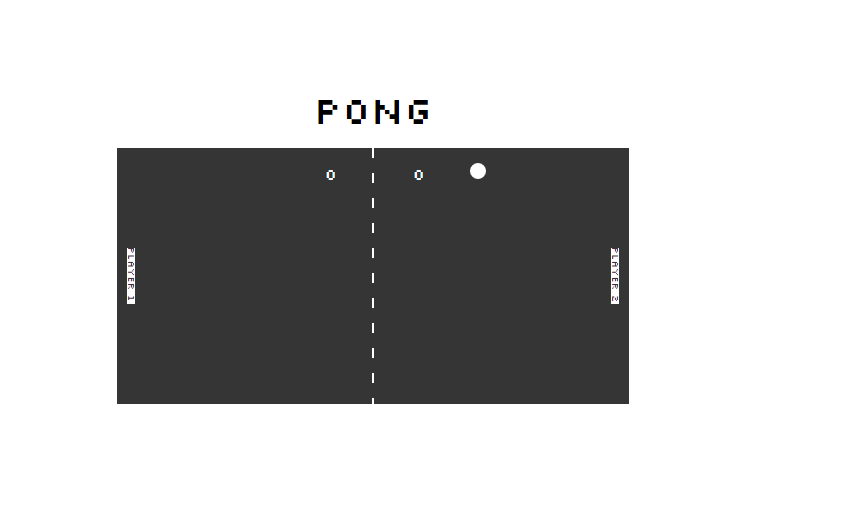

# Pong Game

A basic pong game using SVGs. 3rd project as a part of the RED Academy Web Developer Professional program.

## Screenshots

### Pong Game

## Setup

**Install dependencies:**

`> npm i`

**Run locally with Webpack Dev Server:**

`> npm start`

**Build for production:**

`> npm run build`

## How to Play

### Keys

- Spacebar: Pause the game

**Player 1:**

- a: up
- z: down

**Player 2:**

- ▲ : up
- ▼: down

### Rules

- Paddles have collision detection on their top, bottom and front sides.
- Ball bounces back in the opposite direction after collision with a paddle.
- The ball gets faster after every paddle collision.
- Player scores if the ball hits the wall behind the opposing player.
- Users gets to enter their names, and the names are displayed on their corresponding paddles.
- When a player reaches 10 points the game restarts. An alert message is displayed indicating the winner.

## Technology Used

- HTML
  - SVGs
- Javascript
- Webpack
  - Browser Sync
  - Compile Partial JavaScript files to a minified Bundle.js file

## Personal Experience

This was the 3rd project I did as a part of the RED Academy Web Developer program. As opposed to using Gulp as we did in our previous project, we have used webpack to handle tasks such as the ones listed above. Using SVGs to create images and using JavaScript to animate them was quite a fun experience. Almost as fun as playing pong with classmates. Overall this was the most JavaSript heavy project we have built as a part of the course, and the experience was a great way to test and practice my programming skills.
